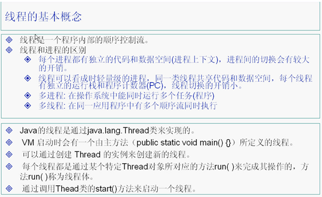
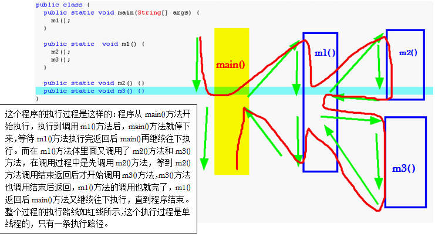

### Java多线程(上篇)





每一个分支都叫做一个线程，main()叫做主分支，也叫主线程。

　　程只是一个静态的概念，机器上的一个.class文件，机器上的一个.exe文件，这个叫做一个进程。程序的执行过程都是这样的：首先把程序的代码放到内存的代码区里面，代码放到代码区后并没有马上开始执行，但这时候说明了一个进程准备开始，进程已经产生了，但还没有开始执行，这就是进程，所以进程其实是一个静态的概念，它本身就不能动。平常所说的进程的执行指的是进程里面主线程开始执行了，也就是main()方法开始执行了。进程是一个静态的概念，在我们机器里面实际上运行的都是线程。

　　Windows操作系统是支持多线程的，它可以同时执行很多个线程，也支持多进程，因此Windows操作系统是支持多线程多进程的操作系统。Linux和Uinux也是支持多线程和多进程的操作系统。DOS就不是支持多线程和多进程了，它只支持单进程，在同一个时间点只能有一个进程在执行，这就叫单线程。

　　CPU难道真的很神通广大，能够同时执行那么多程序吗？不是的，CPU的执行是这样的：CPU的速度很快，一秒钟可以算好几亿次，因此CPU把自己的时间分成一个个小时间片，我这个时间片执行你一会，下一个时间片执行他一会，再下一个时间片又执行其他人一会，虽然有几十个线程，但一样可以在很短的时间内把他们通通都执行一遍，但对我们人来说，CPU的执行速度太快了，因此看起来就像是在同时执行一样，但实际上在一个时间点上，CPU只有一个线程在运行。

学习线程首先要理清楚三个概念：

进程：进程是一个静态的概念

线程：一个进程里面有一个主线程叫main()方法，是一个程序里面的，一个进程里面不同的执行路径。

在同一个时间点上，一个CPU只能支持一个线程在执行。因为CPU运行的速度很快，因此我们看起来的感觉就像是多线程一样。
　　什么才是真正的多线程？如果你的机器是双CPU，或者是双核，这确确实实是多线程。

一、进程（process）

1. 程序是在某个操作系统中运行的，在系统中运行的程序就叫进程，进程是操作系统中的概念或叫法，程序=进程

2. 程序在运行期间，要占用CPU、内存等这些资源，这些资源的管理和调配都是由操作系统负责的

3. 一个程序至少对应一个进程，有些程序采用的是多进程架构设计

4. 进程间相互独立，不能互相访问或共享资源

二、线程(thread)

1.进程包含若干个线程   如果一个进程中只包含了一个线程，就叫单线程程序，如果一个进程中只包含了多个线程，就叫多线程程序

2.线程是程序(进程)中更小的一个执行单元

3.火车 - 某个车厢      QQ - 每个聊天窗口

4.一个进程可以拥有多个线程，但至少要有一个线程，即主执行线程(java的main方法)，我们之前写的都是单线程程序。

5.线程不能够单独执行，它必须运行在处于活动状态的进程中，它可与同属一个进程的其他线程共享进程所拥有的全部资源

三、多线程编程

1.JVM是从main方法开始执行的，执行的时候把main方法当成一个线程去执行

2.作用  效果  ：能让某些代码“同时”执行      让给两个for循环同时执行

3.大部分功能还是单线程即可，但是有时候也需要多线程：上传图片  

A.一张一张传

B.多张图片同时上传

4.好处：提过代码执行的效率（多线程可以充分利用CPU和内存的资源）

5.生活案例：工厂刚成立时只有一条生产线，随着市场的开拓，为了提高生产效率，工厂不断增加生产线（生产线 = 线程）

四、多线程跟CPU

1.一心无二用，一个人能同时干多件事情吗？(边看片儿边写字)那计算机是怎么实现的呢？
真正的“同时”是不存在的，CPU在以极快的速度随机轮流执行程序，专业说法是程序在快速轮流抢占CPU资源。速度太快，人感觉不到

2.胶片电影

3.一个(程序)进程中如果只有一条生产线，这个程序称为单线程。
一个(程序)进程中如果有多条生产线，这个程序称为多线程。

4.多个线程同时执行时，CPU会随机性的、极快的、轮流的、执行每个线程。

五、Java的多线程

1.Java中有两类线程：User Thread(用户线程)、Daemon Thread(守护线程或后台服务线程) 。
守护线程的作用是为其他线程的运行提供服务，比如说GC线程。

2.在Java中实现多线程有两种方式：

方式一. 继承Thread类

方式二. 实现Runnable接口

六、方式一

1.一般的类都是很普通的类，类中的方法或其他代码都不能同时执行，都不是生产线类

2.在Java中，专门提供了一个现成的生产线类：Thread类

3.我们定义的普通的类可以继承Thread类，从而让这些普通类变成生产线类

4.步骤：

A.继承Thread类

B.重写run方法，把需要同时执行的代码放进去

C.在main方法中创建几条生产线

D.使用start()方法启动生产线

七、Thread类

public long getId()，获得该线程的标识符(线程 ID) ，它在创建该线程时生成。线程 ID 是唯一的，并终生不变。

public final void setName(String name)，给线程命名，不命名的话都有默认的，格式为：Thread-0、Thread-1...

public final String getName()，获得线程的名字

public void start()，使该线程开始执行，JVM会自动调用该线程的 run() 方法。

public static void sleep(long millis)，让线程休眠(暂停)多少毫秒

public static Thread currentThread()，获得当前正在执行的线程对象的引用。(方式二会用到)


八、多线程程序执行的流程

1.从main开始执行，这就是一个线程了，主线程

2.开始执行main方法中的代码，那么代码中的线程称之为其他线程

3.单线程程序，只要main方法执行完就表示程序结束；多线程程序，所有的线程都执行完，才表示程序结束

4.主线程的“主”不表示先执行或先执行完，表示这个线程是必须有的

九、方式二

1.自定义一个类实现Runnable接口，实现里面的run方法(需要同时执行的代码)      ----不是生产线类

2.在main中创建几条生产线(Thread),需要把它要干的活儿传给它

3.启动生产线

当前线程：CPU当前正在干活的那个线程(currentThread())

代码举例：

```java


/**
 * 继承Thread，生产线类
 */
public class T02_ThreadStudent extends Thread {

	public void run(){   //同时要执行的代码
		for (int i = 1; i <= 10; i++) {
			System.out.println(getName()+"在看第"+i+"页书");
			try {
				Thread.sleep(100);
			} catch (InterruptedException e) {
				e.printStackTrace();
			}
		}
	}
}

/**
 * 实现Runnable接口，并不是生产线类
 */
public class T02_RunnableStudent implements Runnable{

	public void run() {
		for (int i = 1; i <= 10; i++) {
			System.out.println(Thread.currentThread().getName()+"在看第"+i+"页书");
			try {
				Thread.sleep(100);
			} catch (InterruptedException e) {
				e.printStackTrace();
			}
		}
		
	}
}

/**
 * Created by AFinalStone on 2017/6/30.
 */
public class T02_ExampleRunnableAndThread {

    public void testRunnable() {
        Thread t1 =new Thread(new T02_RunnableStudent());   //创建了一条生产线
        Thread t2 =new Thread(new T02_RunnableStudent());   //创建了一条生产线

        t1.start();   //启动
        t2.start();
    }

    public void testThread() {
        //用方式一实现两个学生同时看书(10页/100ms)
        //多线程编程
        //1.同时干什么事      看书    这部分代码应该放在run方法中
        //2.哪些名词应该充当生产线     生产线类
        //3.应该创建或启动几条生产线

        T02_ThreadStudent ts1=new T02_ThreadStudent();   //创建了一条生产线
        ts1.setName("张三");
        T02_ThreadStudent ts2=new T02_ThreadStudent();  //创建了一条生产线
        ts2.setName("李四");

        ts1.start();
        ts2.start();

        //思考：为什么不直接调用run()方法，而是调用start()方法来启动线程？
        //run()其实就是一个很普通的方法，而start()方法内部调用了run()，可以当成生产线去执行
    }

}

```

十、线程安全问题

1.概念：多个线程操作的是同一个共享资源，但是线程之间是彼此独立的，因此就会出现数据不同步更新的情况，这就是线程安全问题

2.条件：

a.多个线程

b.有共享资源

c.每个线程都操作或使用了共享资源（线程之间是互相独立的）
	
3.模拟实现：除夕那天北京到杭州的动车票只剩下10张，两个窗口同时在卖

a.同时要干的活：卖这10张票       

b.自定义一个类型（不是生产线类）

c.在main中创建两个生产线(窗口)并启动

4.在代码中，共享资源怎么体现出来？共享资源一般通过属性来编写出来，在创建生产线时需要传进去同一个对象(run())

5.怎么解决线程安全问题？

 大概的思路：就是把某些代码当成一个整体，就是给某些代码上锁      同步(锁)

6.在火车的车厢里上厕所

7.Java同步机制的实现方式：

a.同步代码块

b.同步方法(函数)
	
十一、同步代码快

1.语法格式：

```markdown
synchronized（对象）{    //可以使用任意对象的锁，包括this
	操作共享数据的代码即需要同步的代码；
}
```
锁：监视器    遍地都是锁   任意一个对象内部都有一个监视器(锁)

十二、同步方法

```markdown
public synchronized void sell(){  
    //锁是固定的this，即当前对象
	操作共享数据的代码即需要同步的代码；
}
```

把需要上锁的代码摘出来放到一个方法中，但是这个方法必须是同步方法，然后在run()中进行调用
同步方法的锁是固定不变的this,一个类中既可以有同步方法也可以有普通方法	

- 代码举例：

```java

public class T03_SaleWindow implements Runnable {

    private int ticket = 10;   //火车票的编号     共享资源

    public void run() {

        for (int i = 0; i < 10; i++) {
        {
            if (ticket >= 1) {
                System.out.println(Thread.currentThread().getName()
                        + "在卖编号为" + ticket + "的火车票");
                ticket--;
                try {
                    Thread.sleep(500);
                } catch (InterruptedException e) {
                    e.printStackTrace();
                }
            } else {
                System.out.println("没票了");
                break;
            }
        }
        }
    }
}
```
```java
public class T03_SaleWindowSynchronized01 implements Runnable{
	
	private int  ticket = 10;   //火车票的编号     共享资源

	public void run() {
		
		for (int i = 0; i < 10; i++) {
			synchronized (this) {   //同步代码快
				if (ticket >= 1) {
					System.out.println(Thread.currentThread().getName()
							+ "在卖编号为" + ticket + "的火车票");
					ticket--;
					try {
						Thread.sleep(500);
					} catch (InterruptedException e) {
						e.printStackTrace();
					}
				} else {
					System.out.println("没票了");
					break;
				}
			}
		}
	}
}
```
```java

public class T03_SaleWindowSynchronized02 implements Runnable {

	private int ticket = 10; // 火车票的编号 共享资源

	public synchronized void sale() {

		if (ticket >= 1) {
			System.out.println(Thread.currentThread().getName() + "在卖编号为"
					+ ticket + "的火车票");
			ticket--;
			try {
				Thread.sleep(500);
			} catch (InterruptedException e) {
				e.printStackTrace();
			}
		} else {
			System.out.println("没票了");
		}

	}

	public void run() {
		for (int i = 0; i < 10; i++) {
			sale();
		}
	}
}
```

```java
public class T03_ExampleSaleWindow {

    public void testSaleWindow(){
        T03_SaleWindow t03_saleWindow = new T03_SaleWindow();

        Thread t1 = new Thread(t03_saleWindow);   //窗口1
        Thread t2 = new Thread(t03_saleWindow);   //窗口2

        t1.start();
        t2.start();
    }

    public void testSaleWindowBySynchronized01(){
        T03_SaleWindowSynchronized01 sw = new T03_SaleWindowSynchronized01();

        Thread t1 = new Thread(sw);   //窗口1
        Thread t2 = new Thread(sw);   //窗口2

        t1.start();
        t2.start();
    }

    public void testSaleWindowBySynchronized02(){

        T03_SaleWindowSynchronized02 sw=new T03_SaleWindowSynchronized02();

        Thread t1=new Thread(sw);
        Thread t2=new Thread(sw);

        t1.start();
        t2.start();
    }
}

```

十三、细节

1.在解决线程安全问题时，多个线程使用的锁必须是同一把锁

同步的优劣：

2.优：能解决线程安全问题

3.劣：耗费大量资源，影响程序执行的速度(效率)

线程安全和性能不能兼得

4.静态方法能不能同步？类自身   
	
项目地址：[传送门](https://github.com/AFinalStone/Java_Thread)