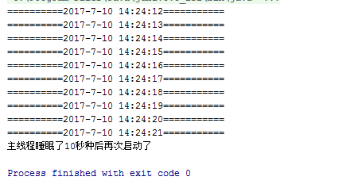
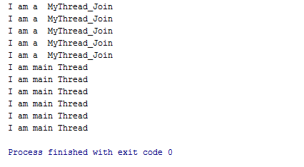
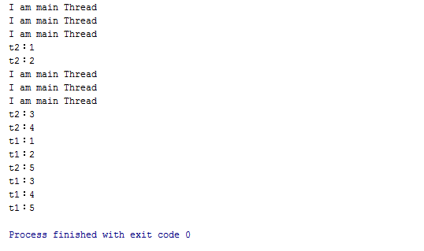

### Java多线程(下篇)

一、死锁

1.同步锁 解决了线程安全问题，但会造成性能低下，还可能会引发一个问题（罕见）：死锁

2.例子

a.一个地痞子死后，来到了地狱，到了吃饭的时候，他发现饭桌上面的饭菜非常丰盛，然后好多人围着一张大桌子，一起吃饭，饭菜都上齐了，非常美味，
他们非常饿，开吃吧...但是只有两支筷子，而且是两个人同时各拿一支筷子...如果没有人愿意共享自己的筷子，那么他们就只能饿着...看着...馋着...留着口水.煎熬着...

b.爸爸说：“给我成绩单，就给你零花钱”，儿子说：“给我零花钱，就给你成绩单”，如果两人互不相让...

3.多个线程之间彼此占用对方想使用的资源

4.要使用非常规的手段演示b

5.分析b案例
	
a.爸爸要成绩单    和   儿子要零花钱   这两个事情是同时发生的      多线程
	
b.爸爸是一个线程       儿子是一个线程
	
c.嵌套锁    +  交叉锁
	
```java

public class Son extends Thread {

    public void run() {

        for (int i = 0; i < 3; i++) {
            synchronized (MyLock.lock02_reportCart) {
                System.out.println("son：儿子有成绩单");
                try {
                    com.afinalstone.MyLock.lock02_reportCart.wait(5000);
                } catch (InterruptedException e) {
                    e.printStackTrace();
                }
                synchronized (MyLock.lock02_money) {
                    System.out.println("son：儿子想要爸爸的零花钱");
                }
            }
        }

    }

}

public class Father extends Thread {

    public void run() {
        for (int i=0; i<3; i++){
            synchronized (MyLock.lock02_money) {
                System.out.println("Father：爸爸有零花钱");
                try {
                    MyLock.lock02_money.wait(5000);
                } catch (InterruptedException e) {
                    e.printStackTrace();
                }
            }
            synchronized (MyLock.lock02_reportCart) {
                System.out.println("Father：爸爸想要儿子的成绩单");
            }
        }


    }
}


public class MyLock {
	public static Object lock02_money = new Object();
	public static Object lock02_reportCart = new Object();
}

public class TestFatherSon {

	public static void main(String[] args) {
		new Father().start();
		new Son().start();
	}

}


```
	
二、解决死锁问题 

1.同步代码块，一旦某个线程执行了这个同步代码块，该代码块会自动上锁，当前线程把代码块里面所有的代码全部执行完，锁会自动解开

2.解决思路：不能等着自然解锁，而是有程序员主动的、及时的释放锁(解锁-开锁)

3.开锁的方法：wait()    wait(long)  开锁    在Object类中

4.该方法的作用：

a.释放锁

b.让当前线程休息
	
5.sleep()方法也可以让当前线程休息，没有释放锁的功能

6.任意对象都有一把锁，也有解锁的方法

三、notify方法

1.无参的wait()一旦执行了，会造成当前线程一直睡.....

2.notify()  唤醒某个被wait()的线程

3.自身无法唤醒自身

4.wait()和notify()必须使用的是同一把锁

5.之前的同步代码块是解决线程安全问题，还可以实现线程间的通信（打电话、发消息）

6.结合wait()和notify()并依靠同一把锁，可以实现线程间的通信(可不是互相发消息)。
     锁相当于中间人的作用，两个线程必须用同一把锁(认识同一个中间人)


```java

public class Thread1 extends Thread{
	public void run() {
		
		for (int i = 1; i <= 20; i++) {
			synchronized (MyLock.lock01_thread) {
				System.out.println(i);
				if(i%5==0)
				{
					try {
						MyLock.lock01_thread.notify();
						MyLock.lock01_thread.wait();
					} catch (InterruptedException e) {
						e.printStackTrace();
					}
				}
			}		
		}
	}
}

public class Thread2 extends Thread{        //唤醒Thread1的线程
	public void run(){
		for(int j=0;j<10;j++){
			synchronized (MyLock.lock01_thread) {
				try {
					MyLock.lock01_thread.notify();
					System.out.println("唤醒");
					MyLock.lock01_thread.wait();
				} catch (InterruptedException e) {
					e.printStackTrace();
				}
				
			}
		}
	}
}

public class TestWaitNotify {

	public static void main(String[] args) {
		Thread1 t1=new Thread1();
		t1.start();
		Thread2 t2=new Thread2();
		t2.start();
	}

}

```


四、sleep方法使用实例

```java

public class ThreadSleep {
    public static void main(String args[]) {
        MyThread thread = new MyThread();
        thread.start();//调用start()方法启动新开辟的线程
        try {
            /*Thread.sleep(10000);
            sleep()方法是在Thread类里面声明的一个静态方法，因此可以使用Thread.sleep()的格式进行调用
            */
            /*MyThread.sleep(10000);
            MyThread类继承了Thread类，自然也继承了sleep()方法，所以也可以使用MyThread.sleep()的格式进行调用
            */
            /*静态方法的调用可以直接使用“类名.静态方法名”
              或者“对象的引用.静态方法名”的方式来调用*/
            MyThread.sleep(10000);
            System.out.println("主线程睡眠了10秒种后再次启动了");
            //在main()方法里面调用另外一个类的静态方法时，需要使用“静态方法所在的类.静态方法名”这种方式来调用
            /*
            所以这里是让主线程睡眠10秒种
            在哪个线程里面调用了sleep()方法就让哪个线程睡眠，所以现在是主线程睡眠了。
            */
        } catch (InterruptedException e) {
            e.printStackTrace();
        }
        //thread.interrupt();//使用interrupt()方法去结束掉一个线程的执行并不是一个很好的做法
        thread.flag = false;//改变循环条件，结束死循环
        /**
         * 当发生InterruptedException时，直接把循环的条件设置为false即可退出死循环，
         * 继而结束掉子线程的执行，这是一种比较好的结束子线程的做法
         */
        /**
         * 调用interrupt()方法把正在运行的线程打断
         相当于是主线程一盆凉水泼上去把正在执行分线程打断了
         分线程被打断之后就会抛InterruptedException异常，这样就会执行return语句返回，结束掉线程的执行
         所以这里的分线程在执行完10秒钟之后就结束掉了线程的执行
         */
    }
}

class MyThread extends Thread {
    boolean flag = true;// 定义一个标记，用来控制循环的条件

    public void run() {
        /*
         * 注意：这里不能在run()方法的后面直接写throw Exception来抛异常， 
         * 因为现在是要重写从Thread类继承而来的run()方法,重写方法不能抛出比被重写的方法的不同的异常。
         *  所以这里只能写try……catch()来捕获异常
         */
        while (flag) {
            System.out.println("==========" + new Date().toLocaleString() + "===========");
            try {
                /*
                 * 静态方法的调用格式一般为“类名.方法名”的格式去调用 在本类中声明的静态方法时调用时直接写静态方法名即可。 当然使用“类名.方法名”的格式去调用也是没有错的
                 */
                // MyThread.sleep(1000);//使用“类名.方法名”的格式去调用属于本类的静态方法
                sleep(1000);//睡眠的时如果被打断就会抛出InterruptedException异常
                // 这里是让这个新开辟的线程每隔一秒睡眠一次，然后睡眠一秒钟后再次启动该线程
                // 这里在一个死循环里面每隔一秒启动一次线程，每个一秒打印出当前的系统时间
            } catch (InterruptedException e) {
                /*
                 * 睡眠的时一盘冷水泼过来就有可能会打断睡眠 
                 * 因此让正在运行线程被一些意外的原因中断的时候有可能会抛被打扰中断(InterruptedException)的异常
                 */
                return;
                // 线程被中断后就返回，相当于是结束线程
            }
        }
    }
}

```


五、join方法使用实例

```java
public class TestThreadJoin {
    public static void main(String args[]) {
        MyThread_Join thread2 = new MyThread_Join("MyThread_Join");
        // 在创建一个新的线程对象的同时给这个线程对象命名为mythread
        thread2.start();// 启动线程
        try {
            thread2.join();// 调用join()方法合并线程，将子线程mythread合并到主线程里面
            // 合并线程后，程序的执行的过程就相当于是方法的调用的执行过程
        } catch (InterruptedException e) {
            e.printStackTrace();
        }
        for (int i = 0; i <= 5; i++) {
            System.out.println("I am main Thread");
        }
    }
}

class MyThread_Join extends Thread {
    MyThread_Join(String s) {
        super(s);
        /*
         * 使用super关键字调用父类的构造方法 
         * 父类Thread的其中一个构造方法：“public Thread(String name)” 
         * 通过这样的构造方法可以给新开辟的线程命名，便于管理线程
         */
    }

    public void run() {
        for (int i = 1; i <= 5; i++) {
            System.out.println("I am a\t" + getName());
            // 使用父类Thread里面定义的
            //public final String getName()，Returns this thread's name.
            try {
                sleep(1000);// 让子线程每执行一次就睡眠1秒钟
            } catch (InterruptedException e) {
                return;
            }
        }
    }
}

```


六、yield方法使用实例
```java
public class TestThreadYield {
    public static void main(String args[]) {
        MyThread_Yield t1 = new MyThread_Yield("t1");
        /* 同时开辟了两条子线程t1和t2，t1和t2执行的都是run()方法 */
        /* 这个程序的执行过程中总共有3个线程在并行执行，分别为子线程t1和t2以及主线程 */
        MyThread_Yield t2 = new MyThread_Yield("t2");
        t1.start();// 启动子线程t1
        t2.start();// 启动子线程t2
        for (int i = 0; i <= 5; i++) {
            System.out.println("I am main Thread");
        }
    }
}

class MyThread_Yield extends Thread {
    MyThread_Yield(String s) {
        super(s);
    }

    public void run() {
        for (int i = 1; i <= 5; i++) {
            System.out.println(getName() + "：" + i);
            if (i % 2 == 0) {
                yield();// 当执行到i能被2整除时当前执行的线程就让出来让另一个在执行run()方法的线程来优先执行
                /*
                 * 在程序的运行的过程中可以看到，
                 * 线程t1执行到(i%2==0)次时就会让出线程让t2线程来优先执行 
                 * 而线程t2执行到(i%2==0)次时也会让出线程给t1线程优先执行
                 */
            }
        }
    }
}
```


七、生产者消费者模式

1.研究什么问题？农夫不停的摘水果放到框里，小孩不停的从框里拿水果吃

2.生产速度    跟   消费速度

3.农夫和小孩都需要依靠wait()和notify()调节进度

```java

public class Child extends Thread {

	public void run() {
		while (true) {
			synchronized (Factory.numOfFactory) {
				if(Factory.numOfFactory.size()==0)
				{
					try {
						Factory.numOfFactory.wait();
					} catch (InterruptedException e) {
						e.printStackTrace();
					}
				}
				Factory.numOfFactory.remove(0);
				Factory.numOfFactory.notify();
				System.out.println("小孩吃了一个水果，还有" + Factory.numOfFactory.size() + "个水果");
				try {
					Thread.sleep(10);
				} catch (InterruptedException e) {
					e.printStackTrace();
				}
			}
		}
	}
}

public class FruitFactory extends Thread{
	
	public void run(){
		while (true) {
			synchronized (Factory.numOfFactory) {
				
				if(Factory.numOfFactory.size()>=10)
				{
					try {
						Factory.numOfFactory.wait();
					} catch (InterruptedException e) {
						e.printStackTrace();
					}
				}
				Factory.numOfFactory.add(1);
				Factory.numOfFactory.notify();
				System.out.println("水果场生产一个水果，现在有" + Factory.numOfFactory.size()
						+ "个水果");
				try {
					Thread.sleep(500);
				} catch (InterruptedException e) {
					e.printStackTrace();
				}
			}
		}
	}

}

public class Factory {
	public static ArrayList<Integer> numOfFactory = new ArrayList<>();  //规定长度不能超过30
}

public class TestChild_FruitFactory {

	public static void main(String[] args) throws Exception {
		new FruitFactory().start();
		new Child().start();
	}

}

```


八、单例设计模式

1.实例化    实例

2.单个实例   只能创建出来一个对象

3.步骤

a.限制构造方法

b.把创建对象的代码放到一个静态的方法中并返回这个对象

c.增加一个静态属性，当该属性的值为null时才创建对象

4.懒汉式这种写法是否存在线程安全问题？会存在

5.只需要把getInstance方法改为同步方法即可解决线程安全问题

6.饿汉式没有线程安全问题，因此推荐使用

7.一般情况，懒汉式更常见

```java
//饿汉式
public class Student_hunger {
	private static Student_hunger s=new Student_hunger();
	
	private Student_hunger() {
	}
	
	public static Student_hunger getInstance()
	{
		return s;
	}
}

//懒汉式
public class Student_lazybones {

	private static Student_lazybones s=null;
	
	private Student_lazybones() {
	}
	
	public synchronized static Student_lazybones getInstance()
	{
		if(s==null)
		{
			s=new Student_lazybones();
		}
		return s;
	}

}
public class ThreadStudent extends Thread{
	
	public void run(){
		
		for (int i = 0; i < 10; i++) {
			Student_lazybones s= Student_lazybones.getInstance();
			System.out.println(s.hashCode());
		}
		
	}
}

public class Main {

	public static void main(String[] args) {
		testLazyBones();
		testHunger();
		testThreadStudent();
	}

	private static void testLazyBones(){
		Student_lazybones s1= Student_lazybones.getInstance();
		System.out.println(s1.hashCode());

		Student_lazybones s2= Student_lazybones.getInstance();
		System.out.println(s2.hashCode());
	}

	private static void testHunger(){
		Student_hunger ss1= Student_hunger.getInstance();
		System.out.println(ss1.hashCode());

		Student_hunger ss2= Student_hunger.getInstance();
		System.out.println(ss2.hashCode());
	}

	private static void testThreadStudent(){
		for (int i = 0; i < 3; i++) {
			new ThreadStudent().start();
		}
	}
}

```
项目地址：[传送门](https://github.com/AFinalStone/Java_Thread)


